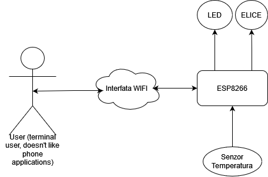
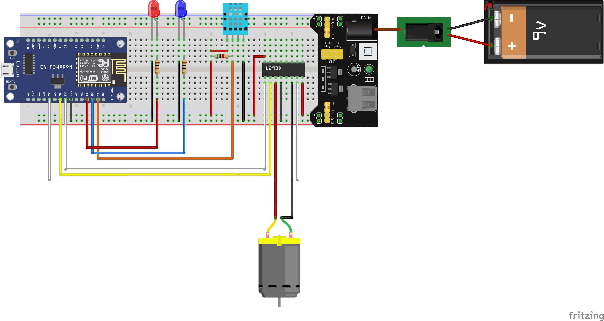

# Temperatura Wireless

## Introducere

Acest proiect are ca scop construirea unui sistem de monitorizare a
temperaturii și umidității cu capabilități wireless de interacțiune.
Senzorul va fi capabil să detecteze valorile ambiante ale temperaturii
și umidității, iar pe baza parametrilor configurabili prin interfața
Wi-Fi, va declanșa acțiuni precum aprinderea LED-urilor sau pornirea
unei elice.

## Descriere generală

Sistemul va fi compus din următoarele module principale:

      * Modul de achiziție date: Va include un ESP8266 și un senzor de temperatură și umiditate. ESP8266 va fi programat să citească valorile de la senzor și să le transmită wireless pe o rețea Wi-Fi.
      * Interfață Wi-Fi: Va oferi utilizatorului posibilitatea de a se conecta la sistem prin intermediul unei rețele Wi-Fi și de a configura parametrii de funcționare, cum ar fi valorile de temperatură și umiditate la care se vor declanșa acțiunile dorite.
      * Modul de acționare: Va include LED-uri sau o elice care vor fi activate de ESP8266 pe baza parametrilor configurați.

## Hardware Design

#### Componente hardware și utilizare:

      * ESP8266: Microcontroler Wi-Fi care va fi programat să citească datele de la senzor, să le transmită wireless și să controleze acțiunile.
      * Senzor de temperatură și umiditate (DHT11): Va detecta valorile ambiante ale temperaturii și umidității și le va transmite ESP8266.
      * LED-uri: Vor fi conectate la ESP8266 și vor fi aprinse când valorile temperaturii sau umidității depășesc parametrii configurați.
      * L293D H-Bridge Motor Driver: Folosit pentru controlul motorașului
      * Motoraș: Învârtește elicea
      * Elice: Face vânt.
      * Breadboard power supply: Elimenteza cu 5V senzorul si motor driver-ul.
      * Baterie 9V alimenteaza power supply-ul
      * Fire
      * Rezistente
      * Breadboard: O placă de prototipare care va fi utilizată pentru a conecta componentele hardware fără a fi necesară lipirea lor.

#### Folosirea pinilor ESP8266

ESP8266 pune la dispozitia utilizatorului 9 pini digitali

      * D1 Preluarea datelor de la senzor.
      * D2 Aprinderea LED-ului pentru umiditate.
      * D3 Aprinderea LED-ului de temperatura.
      * D5 Controleaza viteaza motorului prin componenta L293D.
      * D6 si D8 Controleaza directia motorului prin componenta L293D.

## Software Design

#### Mediu de dezvoltare

Am ales sa folosesc Visual Studio Code, cu extensia PlatformIO, pe un
sistem x86_64 cu sistem-ul de operare Windows 11.

#### Biblioteci si surse 3rd-party

-   [Arduino for
    ESP8266](https://registry.platformio.org/platforms/platformio/espressif8266)
    folosit pentru: utilizarea serialei, activarea pinilor, WIFI, TCP,
    UDP, timere (Ticker).
-   [SimpleDHT](https://registry.platformio.org/libraries/winlinvip/SimpleDHT)
    pentru citirea senzorului.

#### Logica program

Proiectul este împărțit in doua bucăți logice:

-   Server, rulează pe microcontroler.
    -   Citește senzorul si deschide doua led-uri si un motor in funcție
        de temperatura/umiditate.
    -   Face broadcast in rețeaua locala pentru a anunța potențialii
        clienți de prezenta sa si de propria adresa IP.
    -   Permite conectarea unui client prin WIFI la el.
-   Client, se conectează la server
    -   Cauta server-ul in rețea si se conectează la el.
    -   Poate cere valorile citite se senzor.
    -   Poate modifica parametri de aprindere a led-urilor si a
        motorului.

Pentru funcționare client-ul si server-ul trebuie sa fie in aceeași
rețea. Server-ul poate menține legătura doar cu un client la un anumit
moment.

## Rezultate Obținute/Concluzii

Proiectul fiind unul destul de simplu funcționează cum te ai aștepta. O
problema este descărcarea rapidă a bateriei de 9V si faptul că uneori nu
merge :).

## Bibliografie/Resurse

-   <https://github.com/esp8266/Arduino>
-   <https://github.com/winlinvip/SimpleDHT>
-   <https://fritzing.org/>
-   <https://www.mouser.com/datasheet/2/758/DHT11-Technical-Data-Sheet-Translated-Version-1143054.pdf>
-   <https://www.ti.com/lit/ds/symlink/l293d.pdf?ts=1715707378297&ref_url=https%253A%252F%252Fwww.ti.com%252Fproduct%252FL293D>
